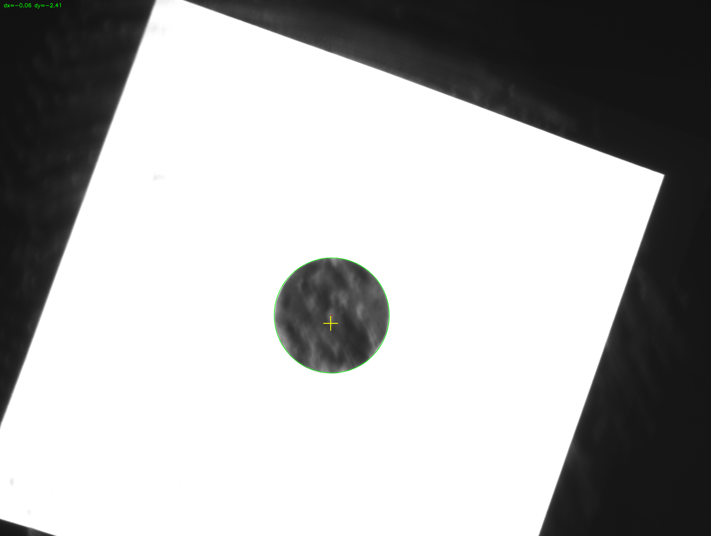

# ROKAE 工业六轴机械臂视觉控制

工作区包含相机控制、视觉检测与 Socket 服务端，用于跟踪圆形工件并把偏差发送给机械臂，实现机械臂对目标实时跟随定位。

## 概述

- `CameraControl/`  
  海康相机封装（`HikCamera.py`），支持触发与取帧。
- `Socket/`  
  Socket 服务端（`Socket.py`），接收机器人指令、进行视觉计算并返回 `dx/dy/rz`。
- `Calibration/`  
  交互式标定工具，用于像素到毫米的比例与轴方向标定。

## 运行流程

1. 机器人连接 Socket 服务端（PC 作为服务器）。
2. 机器人发送 `DW\r`。
3. PC 采集一帧图像，检测圆形目标并计算 `dx/dy`。
4. PC 返回 `tag, dx, dy, rz`（4 行，`\r` 分隔）。
5. 机器人根据偏差做小步移动，逐步收敛。

## 调试图

Socket 服务端会把调试图保存到 `Workspace/Socket/debug/`：

- `vision_vis.png`（检测叠加图）
- `vision_th.png`（二值图）

当前调试图如下：

  
  

## 注意事项

- 使用 `Calibration/calibrate_circle.py` 标定 `_kx_mm_per_px` 和
  `_ky_mm_per_px`，并写回 `Socket/Socket.py`。
